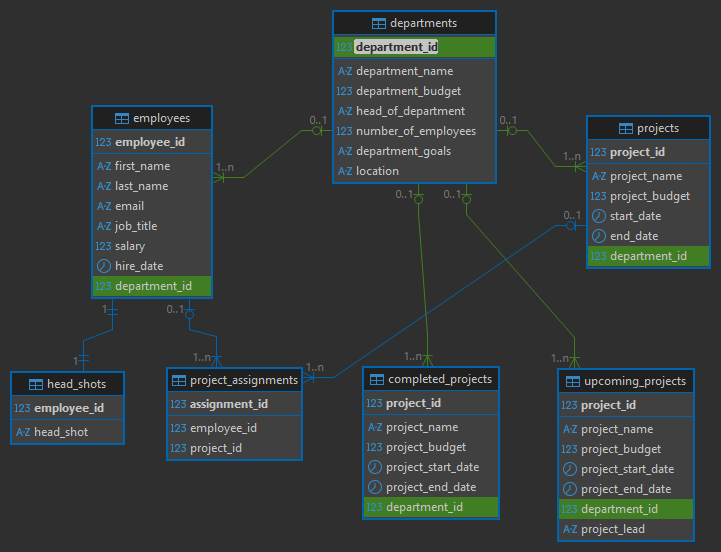
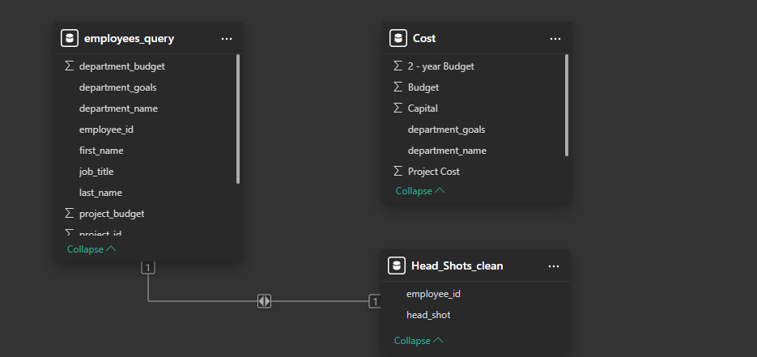
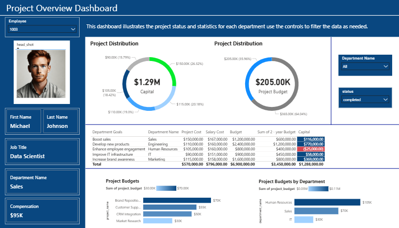

# 📊 Project Budgeting System

## 📌 Overview
This project implements a complete end-to-end data solution for managing departments, employees, and projects.
It covers the full lifecycle of data management:
- Database schema design in `PostgreSQL`
- ETL processes in `Python` for data cleaning and loading
- `SQL` queries for analytics and reporting
- Interactive dashboards in `Microsoft Power BI` for visualization

The system ensures structured data storage and provides insights for **budgeting, workforce planning, and project tracking**.

---

📌 Business Problem

Organizations need to manage workforce, understand financial risks, and monitor project health more effectively.

This project addresses the following key questions:
1. Identify departments and projects at risk detect which units are over budget or underperforming.
2. Data organization - structure data from employees, salaries, department budgets, and projects for reporting.
3. Power BI dashboard – provide visibility into employee performance, salary distribution, and departmental project management.
- Department budgets are defined at 2-year intervals. The goal is to check whether one year of budget allocation can cover all expenses.
---

🛠️ Solution Approach
- Capital = `[Budget] * 0.5 - ([Salary Cost] * 2 + [Project Cost])`
- 2-Year Budget = `[Budget] * 0.5`

The formulas ensure that half of the department’s budget (allocated for a 2-year period) is analyzed against actual salary and project costs to determine financial stability.

---

## 📂 Project Structure

- data/ -> Raw and cleaned CSV datasets
- etl/ -> Python ETL scripts for loading and transforming data
- PostgreSQL/DDL/ -> SQL scripts to create tables
- PostgreSQL/DML/ -> SQL scripts to query data
- docs/ -> Documentation, ERD diagram, and notes
- reports/ -> Power BI .pbix reports and exported visuals
---

## ⚙️ How to Run

### 1. Clone the Repository
```bash
git clone [https://github.com/diyorIsamukhamedov/project-budgeting.git]

cd project_budgeting
```
### 2. Create Database Schema

Run DDL script(s) in PostgreSQL (e.g. in DBeaver or psql):
```bash
\i PostgreSQL/DDL/project_budgeting_struct_db.sql
```

### 3. Load Data via ETL

Execute the Python ETL pipline:
```bash
python etl/load_clean_data.py
```
This code will load all cleaned CSV files into the corresponding tables.

### 4. Run Queries

Use provided DML scripts, e.g.:
```bash
\i PostgeSQL/DML/select_all.sql
```

---

🗂️ Database Schema (ERD)

The database is normalized and follows relational design principles
 - ERD generated in DBeaver -> docs/erd_postgresql.png



 - ERD from Power BI Model View → docs/erd_powerbi_model.png

 
---

📈 Example Query

Employees by Department:
```bash
SELECT e.first_name, e.last_name, d.department_name
FROM employees e
INNER JOIN departments d
    ON e.department_id = d.department_id;
```

---

📊📉 Power BI Dashboards
The Power BI dashboards provide interactive insights with the following features:

- 🔎 Employee selection via Slicer -> selecting an Employee ID dynamically updates all visuals.
- 🖼️ Employee photos -> linked by employee_id from the dataset.
- 💰 Financial KPIs -> Budget, Salary Cost, Project Cost, and calculated columns (e.g., 2-Year Budget = Budget * 0.5).
- 📊 Visuals -> Donut charts (Capital and Project Budget distribution), Bar charts - Departmental project budgets, Table (Department goals, costs, salaries, and budgets).
- 📌 Example Dashboard Screenshot:

---

🦾 Technologies Used

- `PostgreSQL` – Database management
- `Python` (psycopg2, dotenv, pandas, and os) – ETL and automation
- `DBeaver` – SQL IDE and ERD generation
- `Git/GitHub` – Version control
- `Power BI` Business Intelligence and visualization (Power Query, Slicers, Model View)

---

📌 Key Outcomes

| Problem | Solution | Outcome |
|---|----------------------------------------------------------|------------|
| Some departments and projects spend more than budget. | Use SQL and Power BI to compare real costs with budget. | ✅ Found departments and projects that are over budget. |
| Budgets are for 2 years, but money is spent every year. | Formula: 2-Year Budget = Budget * 0.5 to check 1 year. | ✅ Checked if 1-year budget is enough for salaries and projects. |
| Data is in many files: employees, salaries, projects, departments. | Create PostgreSQL database and ETL process to organize data. | ✅ Made one clean data model for all information. |
| Managers cannot see clear reports about money and work. | Build Power BI dashboard with charts, slicers, and KPIs. | ✅ Managers can see simple reports and make better decisions.|

---

👨‍💻 Author
#### Developed by: [Diyor Isamukhamedov](https://github.com/diyorIsamukhamedov/)