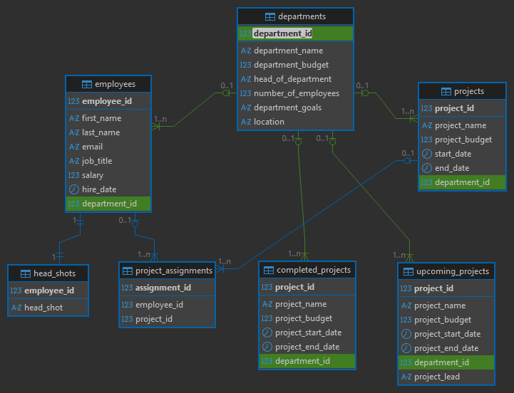

# 📊 Project Budgeting Database

## 📌 Overview
This project implements a complete **database solution for managing departments, employees, and projects**.
It covers the full cycle of work with data:
- Database schema design in PostgreSQL
- ETL processes in Python for data cleaning and loading
- SQL queries for analytics and reporting
- Future integration with **Microsoft Power BI** for interactive dashboards

The system ensures structured data storage and provides insights for budgeting, workforce planning, and project tracking.

---

## 📂 Project Structure

- data/ # Raw and cleaned CSV datasets
- etl/ # Python ETL scripts for loading and transforming data
- PostgreSQL/DDL/ # SQL scripts to create tables
- PostgreSQL/DML/ # SQL scripts to query data
- docs/ # Documentation, ERD diagram, and notes

---

## ⚙️ How to Run

### 1. Clone the Repository
```bash
git clone [https://github.com/diyorIsamukhamedov/project-budgeting.git]

cd project_budgeting
```
### 2. Create Database Schema

Run DDL script(s) in PostgreSQL (e.g. in DBeaver or psql):
```bash
\i PostgreSQL/DDL/project_budgeting_struct_db.sql
```

### 3. Load Data via ETL

Execute the Python ETL pipline:
```bash
python etl/load_clean_data.py
```
This code will load all cleaned CSV files into the corresponding tables.

### 4. Run Queries

Use provided DML scripts, e.g.:
```bash
\i PostgeSQL/DML/select_all.sql
```

---

📊 Database Schema (ERD)

The database is normalized and follows relational design principles



---

📈 Example Query

Employees by Department:
```bash
SELECT e.first_name, e.last_name, d.department_name
FROM employees e
INNER JOIN departments d ON e.department_id = d.department_id;
```

---

📊📉 Example Dashboards (Power BI – Planned)
In the next phase, Power BI dashboards will be created to visualize key insights, such as:

- Department budget utilization
- Employee distribution by project
- Completed vs. upcoming projects
- 📌 Screenshots of dashboards will be added here once developed.

---

🦾 Technologies Used

- `PostgreSQL` – Database management
- `Python` (psycopg2, dotenv, pandas, and os) – ETL and automation
- `DBeaver` – SQL IDE and ERD generation
- `Git/GitHub` – Version control
- `Power BI` (planned) – Business Intelligence and visualization

---

👨‍💻 Author
#### Developed by: `Diyor Isamukhamedov`